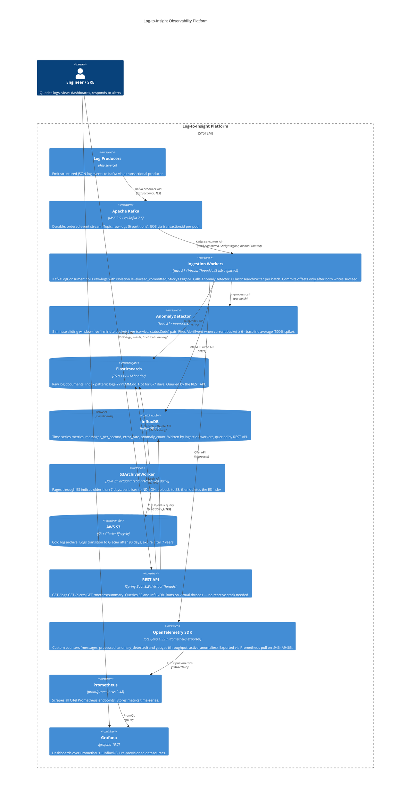

# System Architecture

## C4 Container Diagram



## Data Flow Summary

```
Log Producer
    │  (transactional Kafka producer, EOS write-side)
    ▼
Kafka Topic: raw-logs  (6 partitions, retention=7d)
    │  (read_committed isolation, StickyAssignor, manual offset commit)
    ▼
KafkaLogConsumer  ──── per batch ────►  AnomalyDetector
    │                                         │ alert fired?
    │  bulkWrite()                            ▼
    ▼                                   AlertEvent → in-memory list
Elasticsearch: logs-YYYY.MM.dd               (REST API serves via GET /alerts)
    │
    │  (S3ArchivalWorker, daily at 00:00 UTC)
    ▼
S3: logs/YYYY/MM/DD/logs-YYYY.MM.dd.ndjson
    │  (Glacier lifecycle after 90d, expiry after 7y)
    ▼
AWS Glacier
```

## Storage Sizing (rough estimates)

| Tier        | Backend       | Retention | Data shape                              |
|-------------|---------------|-----------|-----------------------------------------|
| Hot         | Elasticsearch | 7 days    | Raw JSON log docs, ~500 B/doc           |
| Warm        | S3 Standard   | 90 days   | NDJSON blobs, ~same size pre-compress   |
| Cold        | S3 Glacier    | 7 years   | Archived NDJSON, very low access cost   |
| Metrics     | InfluxDB      | unbounded | ~100 B/point, 1 point/s per service     |

## Key Design Decisions

### Exactly-Once Semantics
EOS in Kafka requires coordination at both ends:
- **Producer side**: `transactional.id` set to pod hostname, `enable.idempotence=true`
- **Consumer side**: `isolation.level=read_committed`, `enable.auto.commit=false`, manual `commitSync` only after all downstream writes succeed

This achieves at-least-once delivery with duplicate suppression — true EOS requires idempotent downstream writes (Elasticsearch `PUT /index/id` is idempotent by document ID).

### Virtual Threads vs. WebFlux
See [why-kafka-not-rabbitmq.md](why-kafka-not-rabbitmq.md) for the full decision record.

### Sticky Assignor
`StickyAssignor` minimises partition movement during rebalances compared to the default `RangeAssignor`. This matters for EOS because every rebalance creates a replay window where in-flight batches may be reprocessed. Fewer moved partitions = shorter replay window = lower effective duplicate rate.
